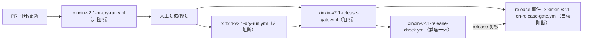

# Xinxin v2.1 一键命令清单（可复制执行）

## 统一命令入口（推荐）
```powershell
# 1) 一键检查（pipeline）
powershell -ExecutionPolicy Bypass -File .\scripts\run-xinxin-v2.1.ps1 -Mode check -RunDir .\xinxin-run

# 2) 仅检查健康度
powershell -ExecutionPolicy Bypass -File .\scripts\run-xinxin-v2.1.ps1 -Mode check -RunDir .\xinxin-run

# 3) 仅重建交付清单
powershell -ExecutionPolicy Bypass -File .\scripts\run-xinxin-v2.1.ps1 -Mode pack -RunDir .\xinxin-run

# 4) 检查状态并输出重训/验收入口提示
powershell -ExecutionPolicy Bypass -File .\scripts\run-xinxin-v2.1.ps1 -Mode audit -RunDir .\xinxin-run

# 5) 直接落地审计报告（PASS/FAIL + 逐状态矩阵）
powershell -ExecutionPolicy Bypass -File .\scripts\audit-xinxin-v2.1.ps1 -RunDir .\xinxin-run

# 6) 一键全流程（完整体检 + 自动审计 + 生成 run-log 草稿）
powershell -ExecutionPolicy Bypass -File .\scripts\run-xinxin-v2.1.ps1 -Mode all -RunDir .\xinxin-run

# 7) 从最新审计生成/更新 run-log
powershell -ExecutionPolicy Bypass -File .\scripts\generate-v2.1-run-log.ps1 -RunDir .\xinxin-run

```powershell
# 8) 人工逐状态复核入库（示例）
powershell -ExecutionPolicy Bypass -File .\scripts\set-v2.1-manual-review.ps1 -RunDir .\xinxin-run `
  -StateReview "idle:PASS" `
  -StateReview "waiting:PASS" `
  -StateReview "running:PASS" `
  -StateReview "review:PASS" `
  -Reviewer "xinxin"
```

```powershell
# 9) 发布门禁（非阻断）
powershell -ExecutionPolicy Bypass -File .\scripts\check-v2.1-release-gate.ps1 -RunDir .\xinxin-run
```

```powershell
# 10) 发布门禁（阻断）
powershell -ExecutionPolicy Bypass -File .\scripts\check-v2.1-release-gate.ps1 -RunDir .\xinxin-run -RequirePass
```

```powershell
# 11) 发布前一键（先 gate 再产出 run-log summary，便于 CI 下载）
powershell -ExecutionPolicy Bypass -File .\scripts\run-xinxin-v2.1.ps1 -Mode all -RunDir .\xinxin-run -ReviewRunLog -ReleaseGateOutputFile .\xinxin-run\qa\release-gate.json -RunLogOutputFile .\xinxin-run\qa\run-log-release-candidate.md -RunLogSummaryFile .\xinxin-run\qa\run-log-release-candidate-summary.json
```

```powershell
# 12) 一键执行：all + 阻断发布门禁，固定产物名
powershell -ExecutionPolicy Bypass -File .\scripts\run-xinxin-v2.1.ps1 -Mode all -RunDir .\xinxin-run -RequireReleaseGate -RunLogOutputFile .\xinxin-run\qa\run-log-release-candidate.md -RunLogSummaryFile .\xinxin-run\qa\run-log-release-candidate-summary.json
```

## 视觉验收建议（执行后）
```powershell
# 用于下一步逐状态手工验收（含审计报告）：
powershell -ExecutionPolicy Bypass -File .\scripts\collect-pet-run-status.ps1 -RunDir .\xinxin-run
powershell -ExecutionPolicy Bypass -File .\scripts\build-xinxin-delivery-manifest.ps1 -RunDir .\xinxin-run -RequireHealthy
powershell -ExecutionPolicy Bypass -File .\scripts\audit-xinxin-v2.1.ps1 -RunDir .\xinxin-run
```

## 快速失败修复路径
- 先检查：`qa\v2.1-qa-checklist.md`
- 如有失败：`qa\v2.1-failure-remediation-playbook.md`
- 低干预重跑：按 `qa\v2.1-fast-track-playbook.md`
```powershell
# 13) 主控入口：一键 all 并触发发布门禁（CI 推荐）
powershell -ExecutionPolicy Bypass -File .\scripts\run-xinxin-v2.1.ps1 -Mode all -RunDir .\xinxin-run -RequireReleaseGate
```

## CI 推荐执行（GitHub Actions）

```bash
gh workflow run xinxin-v2.1-release-check.yml --field require_release_gate=true
gh workflow run xinxin-v2.1-release-check.yml --field require_release_gate=true --field run_command_center=true
```

```bash
gh run list --workflow xinxin-v2.1-release-check.yml -L 1
```

### CI 产物输出建议（可直接读）

在上面 workflow 的 run 结果里，建议优先看：
- `recommended_command`
- `recommended_step`
- `recommended_reason`
- `recommended_playbooks`
- `recommended_commands`
- `recommended_notes`
- `recommended_commands_count`
- `schema_valid`
- `schema_errors`
- `remediation_plan`（在 `next-action-collect` 后生成，通常通过 `remediation_plan_path` 读取）
- `remediation_plan_steps`（修复步骤条数）
- `remediation_validation_hint`（修复触发建议）
- `remediation_plan_path`（`next-action-collect` 的修复方案 JSON）
- `remediation_plan_markdown_path`（`next-action-collect` 的修复方案 Markdown）
- `health_status`
- `health_score`
- `needs_attention`
- `health_reasons`
- `health_gate_blocked`
- `health_gate_reasons`
- `health_gate_enabled_fail_on_attention`
- `health_gate_enabled_fail_on_critical`
- `health_gate_enabled_min_health_score`
- `next_action_collect_path`
- `next_action` artifact now includes markdown 清单：`next-action-recommendation.md`（所有相关工作流统一路径）
- 开启 `run_command_center=true` 时新增：
  - `command_center_summary`
  - `command_center_summary_markdown`
  - `command_center_cycle_root`
  - `cycle_report`
  - `cycle_pass`
  - `command_center_pass`
  - `command_center_exit_code`
  - `release_cycle_board_json`
  - `release_cycle_board_markdown`
- `xinxin-v2.1-release-line.yml` 也可通过 `run_command_center=true` 补充上述命令中心字段（用于本地一键线复盘）

CI 上传的 artifact 还会包含以下新增文件（便于复盘）：
- `qa\\next-action-collect.json`
- `qa\\remediation-plan.json`
- `qa\\remediation-plan.md`
- `qa\\next-action-recommendation.md`
- `xinxin-v2.1-command-center-*`（包含 `command-center-summary.*` 与 `release-cycle-board.*`）

```bash
gh workflow run xinxin-v2.1-dry-run.yml --field run_id_prefix=release-20260509 --field runlog_name=run-log-candidate.md --field runlog_summary_name=run-log-candidate-summary.json --field release_gate_name=release-gate.json
gh workflow run xinxin-v2.1-dry-run.yml --field run_id_prefix=release-20260509 --field runlog_name=run-log-candidate.md --field runlog_summary_name=run-log-candidate-summary.json --field release_gate_name=release-gate.json --field run_command_center=true
```

```bash
gh workflow run xinxin-v2.1-release-gate.yml --field run_id_prefix=release-20260509 --field runlog_name=run-log-release.md --field runlog_summary_name=run-log-release-summary.json --field release_gate_name=release-gate.json
gh workflow run xinxin-v2.1-release-gate.yml --field run_id_prefix=release-20260509 --field runlog_name=run-log-release.md --field runlog_summary_name=run-log-release-summary.json --field release_gate_name=release-gate.json --field run_command_center=true
```

## GitHub Actions 入口（推荐工作流）

```bash
gh workflow run xinxin-v2.1-dry-run.yml --field runlog_name=run-log-candidate.md --field runlog_summary_name=run-log-candidate-summary.json --field release_gate_name=release-gate.json
gh workflow run xinxin-v2.1-dry-run.yml --field runlog_name=run-log-candidate.md --field runlog_summary_name=run-log-candidate-summary.json --field release_gate_name=release-gate.json --field run_command_center=true
```

```bash
gh workflow run xinxin-v2.1-release-gate.yml --field runlog_name=run-log-release.md --field runlog_summary_name=run-log-release-summary.json --field release_gate_name=release-gate.json
```

```bash
gh workflow run xinxin-v2.1-pr-dry-run.yml
gh workflow run xinxin-v2.1-pr-dry-run.yml --field run_command_center=true
```

> PR 干跑可通过仓库变量 `XINXIN_PR_DRY_RUN_RUN_COMMAND_CENTER` 控制是否执行命令中心诊断（默认 `false`）；手动触发时可直接传 `run_command_center=true`。

```bash
# 一键配置 PR 干跑命令中心开关（仓库级）
gh variable set XINXIN_PR_DRY_RUN_RUN_COMMAND_CENTER --body true --repo <owner>/<repo>
gh variable set XINXIN_PR_DRY_RUN_RUN_COMMAND_CENTER --body false --repo <owner>/<repo>
```

PR 干跑之外建议同步的变量（便于长期统一策略）：

```bash
gh variable set XINXIN_DRY_RUN_RUN_COMMAND_CENTER --body true --repo <owner>/<repo>
gh variable set XINXIN_DRY_RUN_RUN_COMMAND_CENTER --body false --repo <owner>/<repo>
gh variable set XINXIN_RELEASE_CHECK_RUN_COMMAND_CENTER --body true --repo <owner>/<repo>
gh variable set XINXIN_RELEASE_CHECK_RUN_COMMAND_CENTER --body false --repo <owner>/<repo>
gh variable set XINXIN_RELEASE_LINE_RUN_COMMAND_CENTER --body true --repo <owner>/<repo>
gh variable set XINXIN_RELEASE_LINE_RUN_COMMAND_CENTER --body false --repo <owner>/<repo>
```

## GitHub Actions（发布事件自动阻断）

> 发布事件默认不执行命令中心；可通过仓库变量 `XINXIN_ON_RELEASE_GATE_RUN_COMMAND_CENTER=true` 启用。

```bash
# 一键配置发布事件命令中心开关（仓库级）
gh variable set XINXIN_ON_RELEASE_GATE_RUN_COMMAND_CENTER --body true --repo <owner>/<repo>
gh variable set XINXIN_ON_RELEASE_GATE_RUN_COMMAND_CENTER --body false --repo <owner>/<repo>
```

```bash
gh workflow run xinxin-v2.1-on-release-gate.yml
```

```bash
# 手动触发 on-release-gate（可调健康闸口，默认行为等同仓库变量配置）
gh workflow run xinxin-v2.1-on-release-gate.yml --field fail_on_attention=true --field fail_on_critical=true --field min_health_score=70
gh workflow run xinxin-v2.1-on-release-gate.yml --field fail_on_attention=true --field fail_on_critical=true --field min_health_score=70 --field run_command_center=true
gh workflow run xinxin-v2.1-on-release-gate.yml --field fail_on_attention=true --field fail_on_critical=true --field min_health_score=70 --field run_command_center=true --field retention_days=14
```

## CI 一键线（本地线同构）

```bash
gh workflow run xinxin-v2.1-release-line.yml --field line=baseline
gh workflow run xinxin-v2.1-release-line.yml --field line=gate
gh workflow run xinxin-v2.1-release-line.yml --field line=all
gh workflow run xinxin-v2.1-release-line.yml --field line=gate --field run_id_prefix=release-20260509
gh workflow run xinxin-v2.1-release-line.yml --field line=all --field run_command_center=true
```

## 本地三阶段一键线

```powershell
# 1) baseline：非阻断流水线（检查 + 打包 + 审计 + run-log）
powershell -ExecutionPolicy Bypass -File .\scripts\run-xinxin-v2.1-release-line.ps1 -Line baseline

# 2) gate：带阻断发布门禁的一次执行
powershell -ExecutionPolicy Bypass -File .\scripts\run-xinxin-v2.1-release-line.ps1 -Line gate

# 3) all：本地完整线（带状态快照报告）
powershell -ExecutionPolicy Bypass -File .\scripts\run-xinxin-v2.1-release-line.ps1 -Line all

# 指定批次前缀，便于归档
powershell -ExecutionPolicy Bypass -File .\scripts\run-xinxin-v2.1-release-line.ps1 -Line gate -RunIdPrefix release-20260509
```

## 本地三阶段闭环（新增）

```powershell
# 一条命令完成 baseline -> gate -> all，自动生成 recovery-cycle 报告
powershell -ExecutionPolicy Bypass -File .\scripts\execute-xinxin-recovery-cycle.ps1
```

```powershell
# 指定前缀并落入固定输出目录（适合回放）
powershell -ExecutionPolicy Bypass -File .\scripts\execute-xinxin-recovery-cycle.ps1 `
  -RunIdPrefix release-20260509 `
  -RunDir .\xinxin-run `
  -OutputRoot .\xinxin-run\qa\recovery-cycles `
  -BundleName daily-cycle `
  -Force
```

```powershell
# 只跑闸门线（只测发布闸门）
powershell -ExecutionPolicy Bypass -File .\scripts\execute-xinxin-recovery-cycle.ps1 -OnlyPhases gate -RunIdPrefix release-20260509
```

```powershell
# 只跑 baseline，失败即停（排障）
powershell -ExecutionPolicy Bypass -File .\scripts\execute-xinxin-recovery-cycle.ps1 -OnlyPhases baseline -StopOnFail -RunIdPrefix release-20260509
```

```powershell
# 三段闭环后，生成发布看板（交接摘要）
powershell -ExecutionPolicy Bypass -File .\scripts\build-xinxin-recovery-board.ps1 -OutputRoot .\xinxin-run\qa\recovery-cycles
```

```powershell
# 一条命令：闭环 + 看板（发布前推荐）
powershell -ExecutionPolicy Bypass -File .\scripts\run-xinxin-release-command-center.ps1 `
  -RunIdPrefix release-20260509 `
  -RunDir .\xinxin-run `
  -OutputRoot .\xinxin-run\qa\recovery-cycles `
  -HumanReadable
```

```powershell
# 自动化场景：失败直接退出，不生成看板
powershell -ExecutionPolicy Bypass -File .\scripts\run-xinxin-release-command-center.ps1 `
  -RunIdPrefix release-20260509 `
  -RunDir .\xinxin-run `
  -OnlyPhases baseline `
  -NoBoardOnFail `
  -HumanReadable
```

```powershell
# CI 采集：输出命令中心结构化摘要（JSON + Markdown）
powershell -ExecutionPolicy Bypass -File .\scripts\run-xinxin-release-command-center.ps1 `
  -RunIdPrefix release-20260509 `
  -RunDir .\xinxin-run `
  -OnlyPhases gate `
  -NoBoardOnFail `
  -ReportFormat both `
  -HumanReadable
```

执行完成后可优先读取输出变量：
- `command_center_summary` / `command_center_summary_json`
- `command_center_summary_markdown`
- `release_cycle_board_json`
- `release_cycle_board_markdown`
- `cycle_report`
- `cycle_pass`
- `command_center_pass`
- `command_center_exit_code`
- `command_center_cycle_root`

```powershell
# 自动把核心输出落到 $GITHUB_OUTPUT（在 CI 场景推荐）
powershell -ExecutionPolicy Bypass -File .\scripts\run-xinxin-release-command-center.ps1 `
  -RunIdPrefix release-20260509 `
  -RunDir .\xinxin-run `
  -EmitGithubOutputs
```

本地线默认会额外产出：
- `qa\\release-line-*/next-action-collect.json`
- `qa\\release-line-*/remediation-plan.json`
- `qa\\release-line-*/remediation-plan.md`

其中 `remediation-plan.*` 直接可用于快速复盘（CI 产物语义对齐，推荐优先阅读）。

## 一键线失败快速恢复

- 先看报告：`qa\release-line-*/release-line-report.json`
- 若日志显示 `gate_required=true` 且 `gate_pass=false`，先补跑闸门线：
  - `powershell -ExecutionPolicy Bypass -File .\scripts\run-xinxin-v2.1-release-line.ps1 -Line gate -RunIdPrefix <本次前缀> -NoFail`
- 若 `release-line` 步骤失败（未产出 run-log），先补跑基线线：
  - `powershell -ExecutionPolicy Bypass -File .\scripts\run-xinxin-v2.1-release-line.ps1 -Line baseline -RunIdPrefix <本次前缀>`
- 仅需报告和状态归档时，直接补跑 `all`：
  - `powershell -ExecutionPolicy Bypass -File .\scripts\run-xinxin-v2.1-release-line.ps1 -Line all -RunIdPrefix <本次前缀>`

```powershell
# 读取报告自动输出建议命令（本地）
$report = Get-Content .\xinxin-run\qa\release-line-report.json -Raw | ConvertFrom-Json
Write-Host "line=$($report.line) pass=$($report.summary.pass)"

$runIdPrefix = $report.run_id_prefix
if ([string]::IsNullOrWhiteSpace($runIdPrefix)) {
  $runIdPrefix = 'release'
}

if ($report.summary.pass) {
    Write-Host '下一步：已完成，无需补跑。'
}
elseif ($report.summary.gate_required -and -not $report.summary.gate_pass) {
    Write-Host '下一步：补跑闸门线'
    Write-Host "powershell -ExecutionPolicy Bypass -File .\scripts\run-xinxin-v2.1-release-line.ps1 -Line gate -RunIdPrefix $runIdPrefix -NoFail"
} else {
    Write-Host '下一步：补跑基线线'
    Write-Host "powershell -ExecutionPolicy Bypass -File .\scripts\run-xinxin-v2.1-release-line.ps1 -Line baseline -RunIdPrefix $runIdPrefix -NoFail"
}
Write-Host "failure_hints:"
if ($report.failure_hints) {
  $report.failure_hints | ForEach-Object { Write-Host ("- " + $_) }
}
```

```powershell
# 统一解析任意产物并给出 next step（本地）
.\scripts\resolve-xinxin-next-action.ps1 `
  -ReportPath .\xinxin-run\qa\release-line-report.json `
  -ReleaseGatePath .\xinxin-run\qa\release-gate.json `
  -RunStatusPath .\xinxin-run\qa\run-status.json `
  -RunIdPrefix release-candidate
```

```powershell
# 一键复盘（推荐）：汇总 report + next-action + remediation，给出建议命令
.\scripts\summarize-xinxin-recovery.ps1 `
  -RunDir .\xinxin-run `
  -RunIdPrefix release-candidate `
  -HumanReadable
```

```powershell
# 一键复盘并导出 Markdown（用于交接）
.\scripts\summarize-xinxin-recovery.ps1 `
  -RunDir .\xinxin-run `
  -RunIdPrefix release-candidate `
  -MarkdownOutputPath .\xinxin-run\qa\recovery-digest.md `
  -OutputPath .\xinxin-run\qa\recovery-digest.json
```

```powershell
# 先聚合产物再生成可执行修复计划（推荐）
.\scripts\collect-xinxin-next-artifacts.ps1 `
  -RunDir .\xinxin-run `
  -RunIdPrefix release-candidate `
  -FailOnCritical `
  -FailOnAttention `
  -MinHealthScore 70 `
  -OutputPath .\xinxin-run\qa\next-action-collect.json
.\scripts\infer-xinxin-remediation-plan.ps1 `
  -CollectPath .\xinxin-run\qa\next-action-collect.json `
  -RunIdPrefix release-candidate `
  -HumanReadable `
  -MarkdownOutputPath .\xinxin-run\qa\remediation-plan.md `
  -OutputPath .\xinxin-run\qa\remediation-plan.json
```

```powershell
# 一键转成可读清单（复制推荐命令）
.\scripts\resolve-xinxin-next-action.ps1 `
  -ReportPath .\xinxin-run\qa\release-line-report.json `
  -ReleaseGatePath .\xinxin-run\qa\release-gate.json `
  -RunStatusPath .\xinxin-run\qa\run-status.json `
  -RunIdPrefix release-candidate `
  -HumanReadable
```

```powershell
# 导出为可复制 markdown 清单（适合复盘/交接）
.\scripts\resolve-xinxin-next-action.ps1 `
  -ReportPath .\xinxin-run\qa\release-line-report.json `
  -ReleaseGatePath .\xinxin-run\qa\release-gate.json `
  -RunStatusPath .\xinxin-run\qa\run-status.json `
  -RunIdPrefix release-candidate `
  -MarkdownOutputPath .\xinxin-run\qa\next-action-recommendation.md
```

```powershell
# 一键汇总最近一次产物并输出健康评分（适合小白）
.\scripts\collect-xinxin-next-artifacts.ps1 `
  -RunDir .\xinxin-run `
  -RunIdPrefix release-candidate `
  -OutputPath .\xinxin-run\qa\next-action-collect.json `
  -HumanReadable
```

```powershell
# 一键汇总并开启自动失败门禁（用于 CI）
.\scripts\collect-xinxin-next-artifacts.ps1 `
  -RunDir .\xinxin-run `
  -RunIdPrefix release-candidate `
  -FailOnCritical `
  -FailOnAttention `
  -MinHealthScore 70 `
  -OutputPath .\xinxin-run\qa\next-action-collect.json
```

## collect 输出新增健康闸口字段
- `health_gate.enabled.fail_on_attention`
- `health_gate.enabled.fail_on_critical`
- `health_gate.enabled.min_health_score`
- `health_gate.blocked`
- `health_gate.reasons`

## 工作流总览（建议执行顺序）



## Recovery Digest（恢复摘要）

> 新增：`release-line`、`release-check`、`release-gate`、`dry-run`、`pr-dry-run`、`on-release-gate` 均会生成：
> - `xinxin-run\qa\recovery-digest.json`
> - `xinxin-run\qa\recovery-digest.md`

```powershell
# 一键生成（可直接在任意线后补跑，保持手动复盘）
.\scripts\summarize-xinxin-recovery.ps1 `
  -RunDir .\xinxin-run `
  -RunIdPrefix release-candidate `
  -OutputPath .\xinxin-run\qa\recovery-digest.json `
  -MarkdownOutputPath .\xinxin-run\qa\recovery-digest.md
```

在 GH Actions 产物上优先关注：
- `next_action_path`
- `next-action-recommendation.md`（对应 `next_action_path`）
- `recovery_digest_path`
- `recovery_digest_markdown_path`
- `health_status`
- `health_score`
- `needs_attention`
- `health_gate_blocked`
- `health_gate_reasons`
- `recommended_commands_count`
`release-line` / `release-check` / `release-gate` / `dry-run` / `pr-dry-run` / `on-release-gate`：  
- 手动线开启 `run_command_center=true`，或设置 `XINXIN_PR_DRY_RUN_RUN_COMMAND_CENTER=true`、`XINXIN_ON_RELEASE_GATE_RUN_COMMAND_CENTER=true`（发布事件）后，可再关注：
- `command_center_summary`
- `command_center_summary_markdown`
- `command_center_cycle_root`
- `cycle_report`
- `cycle_pass`
- `command_center_pass`
- `command_center_exit_code`
- `release_cycle_board_json`
- `release_cycle_board_markdown`
- artifact `xinxin-v2.1-command-center-*`（包含 `command-center-summary.json` / `command-center-summary.md` 与回放目录）
